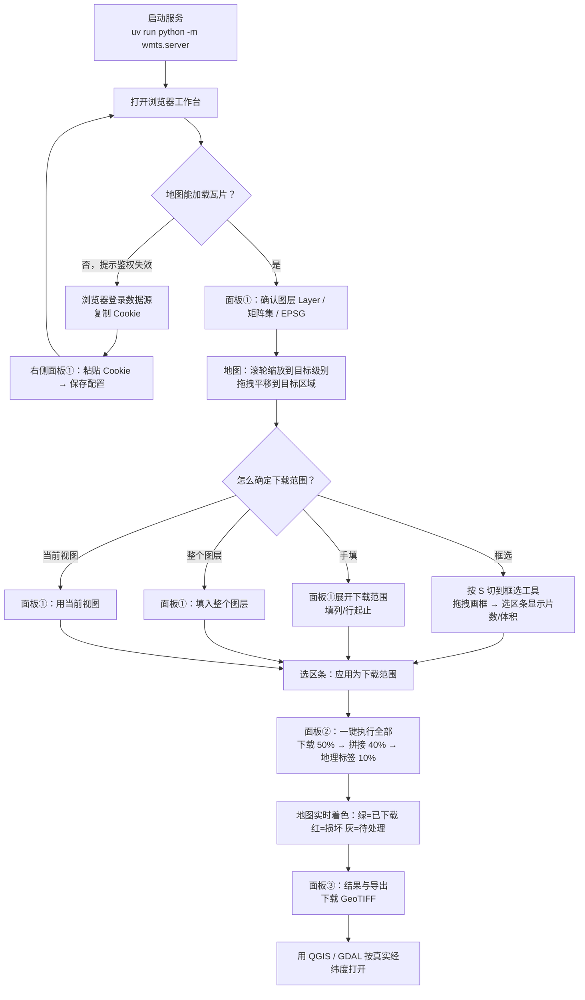
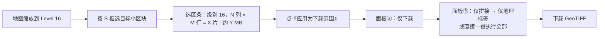
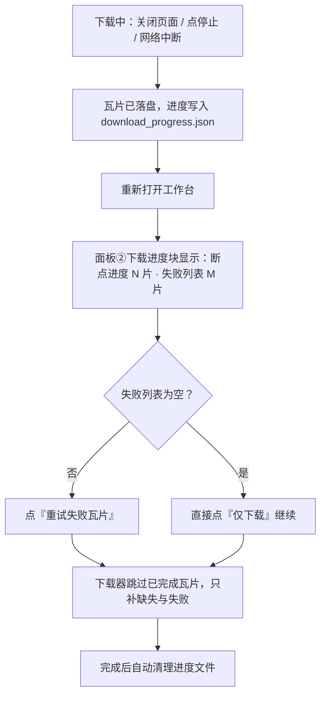
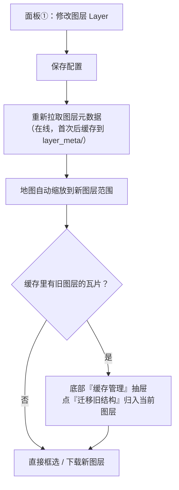
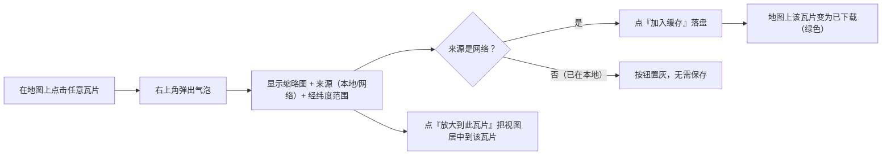
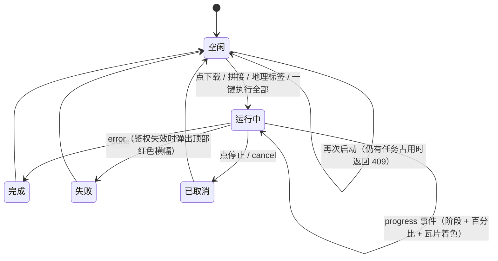

# 使用实例图

本文用 Mermaid 流程图说明 WMTS 瓦片工作台（`uv run python -m wmts.server`）的典型使用路径。
界面为**地图优先工作台**：左边是地图，右边是「数据源与范围 → 任务与进度 → 结果与导出」流程面板，
缓存与日志收在底部抽屉里。

---

## 1. 端到端主流程（首次使用）

> 说明：`一键执行全部` 会按配置里的 `auto_geo` 决定是否在拼接后自动附加地理标签。

---

## 2. 场景 A：只下载一小块区域

要点：框选结果只落在**当前地图级别**上；若想换级别，先切级别再框选，或在面板①手改级别。

---

## 3. 场景 B：下载中断后续传 / 重试失败瓦片

要点：断点续传不需要任何额外操作——重跑下载即可；已下载的瓦片会在地图上显示为绿色。

---

## 4. 场景 C：切换图层

要点：缓存按图层分层（`tiles/{layer}/{matrix}/{row}/{col}.png`），不同图层同坐标互不覆盖；
状态网格/统计只反映当前图层。

---

## 5. 场景 D：单瓦片预览并保存到缓存

---

## 6. 任务状态机（同一时刻仅一个任务）

> 约定：占用期间 `POST /api/tasks` 返回 `409`；进度为单向 SSE，事件带自增 `seq`，
> 先回放缓冲再接实时流，刷新页面后会自动重新接入进行中的任务。
